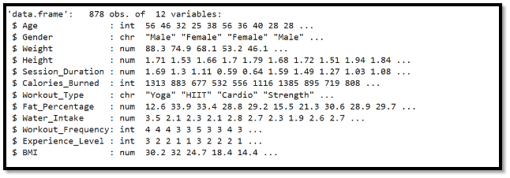
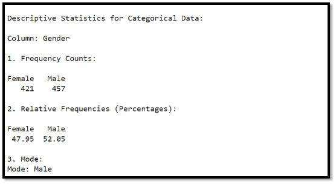

# Table of Contents
[1.	Introduction:	3](#_toc184337327)

[2.	Problem Statement:	3](#_toc184337328)

[3.	Objectives:	3](#_toc184337329)

[4.	Data Description:	3](#_toc184337330)

[**4.1.**	**Key Features of Dataset:**	3](#_toc184337331)

[5.	ALL Required Libraries:	4](#_toc184337332)

[6.	Read CSV File:	4](#_toc184337333)

[7.	To View the Feature of Data:	5](#_toc184337334)

[8.	Descriptive Statistical Measure:	5](#_toc184337335)

[**8.1.**	**Numeric Data (Quantitively Data):**	6](#_toc184337336)

[**8.2.**	**Descriptive Statistical Measure for Qualitative Data:**	9](#_toc184337337)

[9.	Graphical and tabular data representation:	10](#_toc184337338)

[**9.1.**	**Histogram to Represent:**	10](#_toc184337339)

[**9.2.**	**Scatter Plot to Represent:**	14](#_toc184337340)

[9.3.	Pie Chart Represent:	19](#_toc184337341)

[**9.4.**	**Bar Chart and Pie Chart:**	22](#_toc184337342)

[10.	Probability Distribution:	31](#_toc184337343)

[10.1.	Normal Distribution	31](#_toc184337344)

[**10.2.**	**Uniform Distribution**	33](#_toc184337345)

[11.	Discrete Distributions:	35](#_toc184337346)

[**11.1.**	**Poisson distribution:**	35](#_toc184337347)

[**11.2.**	**Binomial Distribution:**	37](#_toc184337348)

[12.	Regression Modeling and Predictions:	39](#_toc184337349)

[13.	Confidence Interval of Descriptive measures and Regression Estimates:	42](#_toc184337350)

[14.	Running Screenshot of Project:	45](#_toc184337351)

1. # **Introduction:**
Gym Analysis and Tracking is a project developed using only R language, focusing on analyzing gym activities and tracking performance metrics. It leverages data visualization and statistical techniques to provide actionable insights for fitness enthusiasts and trainers.
1. # **Problem Statement:**
This project focuses on personalizing fitness routines and hydration plans to enhance health and performance outcomes. It aims to address the challenge of optimizing workout effectiveness by predicting calories burned and estimating optimal water intake based on individual factors like BMI, workout type, session duration, and heart rate.
1. # **Objectives**:
- Developing predictive models to estimate calories burned and personalized water intake.
- Analyzing data to identify key factors influencing fitness outcomes and visualizing relationships.
- Providing actionable insights for personalized fitness planning to improve performance and prevent health issues like dehydration and fatigue.

It helps individuals and fitness professionals optimize health and reach fitness goals using data-driven strategies.
1. # **Data Description:**
This dataset includes 12 variable and 879 values of gym members exercise routines, physical attributes, and fitness metrics, such as heart rate, calories burned, and workout duration.it allows for comprehensive analysis of fitness patterns, athlete progression, and health trends.
1. ## **Key Features of Dataset:**
- **Age:** Age of the gym member.
- **Gender:** Gender of the gym member (Male or Female).
- **Weight (kg):** Member’s weight in kilograms.
- **Height (m):** Member’s height in meters.
- **Session\_Duration (hours):** Duration of each workout session in hours.
- **Calories\_Burned:** Total calories burned during each session.
- **Workout\_Type:** Type of workout performed (e.g., Cardio, Strength, Yoga, HIIT).
- **Fat\_Percentage:** Body fat percentage of the member.
- **Water\_Intake (liters):** Daily water intake during workouts.
- **Workout\_Frequency (days/week):** Number of workout sessions per week.
- **Experience\_Level:** Level of experience, from beginner (1) to expert (3).
- **BMI:** Body Mass Index, calculated from height and weight.

1. # **ALL Required Libraries:**
-----
- install.packages("readr")       # For reading the file
- install.packages("dplyr")       # For the glimpse function
- install.packages("ggplot2")     # For data visualization
- install.packages("scales")      # For percentage formatting
- install.packages("gridExtra")
- install.packages("plotly")
- install.packages("caret")
- install.packages("knitr")

1. # **Read CSV File:**

- #Read a CSV file into a data frame
- Gymdata <- read.csv("/content/Fitness Tracking and Performance Dataset.csv")

- # Preview the data
- head(Gymdata)

1. # **To View the Feature of Data:**
- str(Gymdata)

1. # **Descriptive Statistical Measure:**
-----
Descriptive Statistical Measure for Quotative Data

- if (!requireNamespace("dplyr", quietly = TRUE)) {
- `  `install.packages("dplyr")
- }
- library(dplyr)
- # Separate numeric and categorical columns
- numeric\_data <- Gymdata %>% select(where(is.numeric))
- categorical\_data <- Gymdata %>% select(where(is.factor) | where(is.character))

- # Descriptive statistics for numeric columns
- cat("Descriptive Statistics for Numeric Data:\n\n")
- for (col\_name in names(numeric\_data)) {
- `  `cat("Column:", col\_name, "\n")
- `  `print(summary(numeric\_data[[col\_name]]))
- `  `cat(rep("=", 50), "\n\n")  # Double line separator
- }

1. ## **Numeric Data (Quantitively Data):**

1. ## **Descriptive Statistical Measure for Qualitative Data:**

- Descriptive Statistics for Categorical Data
- cat("\nDescriptive Statistics for Categorical Data:\n\n")

- for (col\_name in names(categorical\_data)) {
- `  `cat("Column:", col\_name, "\n\n")

- `  `# Frequency Counts
- `  `freq\_counts <- table(categorical\_data[[col\_name]])
- `  `cat("1. Frequency Counts:\n")
- `  `print(freq\_counts)

- `  `# Relative Frequencies (Percentages)
- `  `rel\_freq <- prop.table(freq\_counts) \* 100
- `  `cat("\n2. Relative Frequencies (Percentages):\n")
- `  `print(round(rel\_freq, 2))  # Round to 2 decimal places

- `  `# Mode
- `  `mode\_value <- names(which.max(freq\_counts))
- `  `cat("\n3. Mode:\n")
- `  `cat("Mode:", mode\_value, "\n")

- `  `# Line separator
- `  `cat(rep("=", 50), "\n\n")
- }

  ##

1. # **Graphical and tabular data representation:**
   1. ## **Histogram to Represent:**
1. Age
1. BMI
1. Calories\_Burned
1. Session\_Duration
1. # Load necessary libraries
1. library(ggplot2)

1. # Define features for visualization
1. features <- c("Age", "BMI", "Calories\_Burned", "Session\_Duration")

1. # Define attractive light colors for each histogram
1. colors <- c("lightblue", "lightgreen", "peachpuff", "lavender")

1. # Loop through each feature and create individual histograms with specific colors
1. for (i in seq\_along(features)) {
1. `  `hist(
1. `    `Gymdata[[features[i]]],
1. `    `breaks = 20,
1. `    `col = colors[i],
1. `    `border = "gray",
1. `    `main = paste("Distribution of", features[i]),
1. `    `xlab = features[i],
1. `    `ylab = "Frequency"
1. `  `)
1. }

**Interpretation** 

Most people in the group are 20 years old, the number of people is evenly spread across ages from their 20s to 50s, and fewer people are closer to 60 years old.

**Interpretation** 

Most people have a BMI between 20 and 30, with the highest number around 25, and fewer people have a BMI above 40.

**Interpretation** 

Most people burn around 1000 calories, with fewer burning less than 500 or more than 1500 calories.

**Interpretation** 

Most sessions around 1.5 hours, with fewer sessions being shorter than 1 hour or longer than 2 hours. This shows most users spend a moderate amount of time on the platform.

1. ## **Scatter Plot to Represent:**
1. Height
1. Fat\_Percentage
1. Water\_Intake

1. library(ggplot2)
1. library(dplyr)

1. # Define a function to group by a column and count occurrences
1. group\_by\_count <- function(data, col) {
1. `  `data %>%
1. `    `count(.data[[col]], name = "count")
1. }

1. # Define a function to create scatter plots
1. create\_scatter\_plot <- function(data, x, y, title, xaxis\_title, yaxis\_title, color, width = 600, height = 400) {
1. `  `scatter\_plot <- ggplot(data, aes\_string(x = x, y = y, size = y)) +
1. `    `geom\_point(color = color, alpha = 1) +
1. `    `labs(
1. `      `title = title,
1. `      `x = xaxis\_title,
1. `      `y = yaxis\_title
1. `    `) +
1. `    `theme\_minimal(base\_size = 14) +
1. `    `theme(
1. `      `plot.title = element\_text(hjust = 0.5, face = "bold", size = 16, color = "white"),
1. `      `axis.title.x = element\_text(size = 12, color = "white"),
1. `      `axis.title.y = element\_text(size = 12, color = "white"),
1. `      `plot.background = element\_rect(fill = "black", color = NA),
1. `      `panel.background = element\_rect(fill = "black"),
1. `      `panel.grid = element\_line(color = "gray50"),
1. `      `axis.text = element\_text(color = "white")
1. `    `)

1. `  `print(scatter\_plot)
1. }

1. # Define the dataset and features
1. features <- c('Height','Fat\_Percentage', 'Water\_Intake')

1. colors <- c('#FFD700', '#FFA500', '#00FA9A', '#FFB6C1',
1. `            `'#FF1493', '#32CD32', '#00CED1', '#1E90FF',
1. `            `'#FFFF00', '#7CFC00')

1. # Loop through features and create scatter plots
1. for (i in seq\_along(features)) {
1. `  `feature <- features[i]
1. `  `grouped\_data <- group\_by\_count(Gymdata, feature)
1. `  `cat("\n\n")  # Add spacing for output clarity
1. `  `cat(paste("\n", feature, "Distribution\n"))
1. `  `create\_scatter\_plot(
1. `    `grouped\_data,
1. `    `x = feature,
1. `    `y = "count",
1. `    `title = paste(feature, "Distribution"),
1. `    `xaxis\_title = feature,
1. `    `yaxis\_title = "Count",
1. `    `color = colors[i %% length(colors) + 1]  # Cycle through colors
1. `  `)
1. }

s

**Interpretation** 

A scatter plot depicting the distribution of height values, with a concentration of data points around 1.7-1.8 meters

**Interpretation** 

A scatter plot showing the distribution of fat percentage values, with most values falling between 5-15% fat.

**Interpretation** 

A scatter plot showing the distribution of fat percentage values, with most values falling between 5-15% fat.

1. ## Pie Chart Represent:
1. Gender
1. Workout Type
1. library(ggplot2)
1. library(dplyr)

1. # Define the function for pie chart with percentages
1. univariate\_analysis\_pie <- function(data, col) {
1. `  `cat("Distribution of", col, "\n")
1. `  `cat(rep("\_", 60), "\n\n")

1. `  `# Calculate value counts and percentages
1. `  `value\_counts <- data %>%
1. `    `count(.data[[col]], name = "Count") %>%
1. `    `mutate(Percentage = Count / sum(Count) \* 100)

1. `  `# Define color palette
1. `  `colors <- c(
1. `    `'#FFD700', '#FF6347', '#40E0D0', '#FF69B4', '#7FFFD4',
1. `    `'#FFA500', '#00FA9A', '#FF4500', '#4682B4', '#DA70D6',
1. `    `'#FFB6C1', '#FF1493', '#FF8C00', '#98FB98', '#9370DB',
1. `    `'#32CD32', '#00CED1', '#1E90FF', '#FFFF00', '#7CFC00'
1. `  `)

1. `  `# Create pie chart
1. `  `pie\_chart <- ggplot(value\_counts, aes(x = "", y = Percentage, fill = .data[[col]])) +
1. `    `geom\_bar(stat = "identity", width = 1, color = "black") +
1. `    `coord\_polar(theta = "y") +
1. `    `geom\_text(aes(label = paste0(round(Percentage, 1), "%")),
1. `              `position = position\_stack(vjust = 0.5), color = "black", size = 4) +
1. `    `scale\_fill\_manual(values = colors) +
1. `    `labs(
1. `      `title = paste("Distribution of", col),
1. `      `fill = "Categories"
1. `    `) +
1. `    `theme\_minimal(base\_size = 14) +
1. `    `theme(
1. `      `plot.title = element\_text(hjust = 0.5, face = "bold"),
1. `      `axis.text = element\_blank(),
1. `      `axis.title = element\_blank(),
1. `      `panel.grid = element\_blank()
1. `    `)

1. `  `print(pie\_chart)
1. `  `cat("\n")
1. }

1. # Apply the function to each categorical column
1. cat\_columns <- Gymdata %>% select(where(is.factor) | where(is.character))
1. for (col\_name in names(cat\_columns)) {
1. `  `univariate\_analysis\_pie(Gymdata, col\_name)
1. }

**Interpretation** 

It simple Show percentage of Male and Female in given data set.

**Interpretation** 

This Pie Chart show the 25.7% member do Cardio and 24.7% do HIT and so on. 

1. ## **Bar Chart and Pie Chart:**
1. # Load necessary libraries
1. library(ggplot2)
1. library(dplyr)
1. library(gridExtra)

1. # Define a function to create bar plot and pie chart for each feature
1. create\_plots <- function(data, feature) {

1. `  `# Create the bar plot
1. `  `bar\_plot <- ggplot(data, aes\_string(x = feature)) +
1. `    `geom\_bar(fill = "#69b3a2") +
1. `    `labs(title = paste("Distribution of", feature),
1. `         `x = feature,
1. `         `y = "Count") +
1. `    `theme\_minimal() +
1. `    `theme(axis.text.x = element\_text(angle = 0, hjust = 1))

1. `  `# Create the pie chart
1. `  `pie\_data <- data %>%
1. `    `count(!!sym(feature)) %>%
1. `    `mutate(Percentage = n / sum(n) \* 100)

1. `  `pie\_plot <- ggplot(pie\_data, aes(x = "", y = Percentage, fill = as.factor(!!sym(feature)))) +
1. `    `geom\_bar(stat = "identity", width = 1) +
1. `    `coord\_polar(theta = "y") +
1. `    `labs(title = paste(feature, "Proportion"), fill = feature) +
1. `    `theme\_void() +
1. `    `theme(legend.title = element\_blank()) +
1. `    `geom\_text(aes(label = paste0(round(Percentage, 1), "%")), position = position\_stack(vjust = 0.5), color = "black", size = 4)

1. `  `# Arrange the bar plot and pie plot side by side
1. `  `grid.arrange(bar\_plot, pie\_plot, ncol = 2)
1. }

1. # Features to loop through
1. features <- c('Workout\_Frequency','Experience\_Level')

1. # Loop through the features and create plots
1. for (feature in features) {
1. `  `create\_plots(Gymdata, feature)
1. `  `cat("\n \n")
1. }

**Interpretation** 

This bar chart and Pie Chart shows that 20.2% of members exercise 2 days in a week, 10.5% exercise 3 days, 37.8% exercise 4 days, and 31.4% exercise 5 days in a week.

**Interpretation** 

This Pie Chart and Bar Chart show that 38.6% member has 1 experience level 19.6% 2 and 41.7% has 3 experience level.

1. # Load necessary libraries
1. library(ggplot2)

1. # Calculate mean, median, and mode of BMI
1. mean\_bmi <- mean(Gymdata$BMI, na.rm = TRUE)
1. median\_bmi <- median(Gymdata$BMI, na.rm = TRUE)

1. # Calculate mode manually since R does not have a built-in mode function
1. mode\_bmi <- as.numeric(names(sort(table(Gymdata$BMI), decreasing = TRUE)[1]))

1. # Create a density plot with enhanced visuals
1. ggplot(Gymdata, aes(x = BMI)) +
1. `  `geom\_density(fill = "#56B4E9", alpha = 0.6) +  # Smooth density plot with a soft blue fill
1. `  `geom\_vline(aes(xintercept = mean\_bmi, color = "Mean"), linetype = "dashed", size = 1.2) +
1. `  `geom\_vline(aes(xintercept = median\_bmi, color = "Median"), linetype = "dashed", size = 1.2) +
1. `  `geom\_vline(aes(xintercept = mode\_bmi, color = "Mode"), linetype = "dashed", size = 1.2) +
1. `  `scale\_color\_manual(
1. `    `values = c(
1. `      `"Mean" = "#D55E00",
1. `      `"Median" = "#009E73",
1. `      `"Mode" = "#F0E442"
1. `    `),
1. `    `name = "Statistics"  # Legend title
1. `  `) +
1. `  `labs(
1. `    `title = "BMI Density Plot with Mean, Median, and Mode",
1. `    `x = "BMI",
1. `    `y = "Density"
1. `  `) +
1. `  `theme\_minimal() +
1. `  `theme(
1. `    `plot.title = element\_text(size = 20, face = "bold", hjust = 0.5),  # Center-aligned, bold title
1. `    `axis.title.x = element\_text(size = 16, face = "bold", color = "black"),
1. `    `axis.title.y = element\_text(size = 16, face = "bold", color = "black"),
1. `    `axis.text = element\_text(size = 14),
1. `    `plot.background = element\_rect(fill = "#F7F7F7", color = NA),  # Light background for better readability
1. `    `panel.grid = element\_line(color = "gray90"),
1. `    `legend.title = element\_text(size = 14, face = "bold"),  # Legend title styling
1. `    `legend.text = element\_text(size = 12),  # Legend text styling
1. `    `legend.position = "top"  # Place legend at the top for better visibility
1. `  `) +
1. `  `scale\_x\_continuous(expand = expansion(mult = c(0.05, 0.05))) +  # Add padding to x-axis
1. `  `scale\_y\_continuous(expand = expansion(mult = c(0, 0.1)))  # Add padding to y-axis

**Interpretation** 

The scatter plot shows the Correlation between age and calories burned. The data points are spread across a wide range of ages and calorie burn amounts, with higher calorie burns generally associated with younger ages. There appears to be an overall decreasing trend in calories burned as age increases, though the relationship is scattered and not perfectly linear.

1. Example: Mixed data (Categorical vs. Numerical)
1. categorical\_col <- Gymdata$Gender
1. numerical\_col <- Gymdata$`Calories\_Burned`

1. # Tabular representation (Summary statistics grouped by category)
1. grouped\_stats <- aggregate(numerical\_col, by = list(Category = categorical\_col),
1. `                           `FUN = function(x) c(Mean = mean(x), Median = median(x), SD = sd(x)))
1. print("Grouped Statistics:")
1. print(grouped\_stats)

1. # Graphical representation (Boxplot)
1. ggplot(data = Gymdata, aes(x = categorical\_col, y = numerical\_col, fill = categorical\_col)) +
1. `  `geom\_boxplot(color = "black") +
1. `  `labs(title = "Calories Burned by Gender", x = "Gender", y = "Calories Burned") +
1. `  `theme\_minimal(base\_size = 14)

1. # Graphical representation (Scatter Plot for two numerical variables)
1. ggplot(data = Gymdata, aes(x = Age, y = Calories\_Burned)) +
1. `  `geom\_point(aes(color = Calories\_Burned), size = 3, alpha = 0.8) + # Use gradient color for y-variable
1. `  `scale\_color\_gradient(low = "#FF6347", high = "#32CD32", name = "Calories Burned") + # Vibrant color combination
1. `  `labs(title = "Scatter Plot: Age vs. Calories Burned",
1. `       `x = "Age",
1. `       `y = "Calories Burned") +
1. `  `theme\_minimal(base\_size = 14) +
1. `  `theme(
1. `    `plot.title = element\_text(hjust = 0.5, size = 16, face = "bold", color = "#333333"),
1. `    `axis.title = element\_text(size = 12, face = "bold"),
1. `    `panel.background = element\_rect(fill = "white"),
1. `    `panel.grid = element\_line(color = "gray90")
1. `  `)

**Interpretation** 

Females tend to burn fewer calories than males during gym sessions. Females burned around 800 calories on average, while males burned around 900 calories on average during gym sessions.

**Interpretation** 

Overweight individuals have longer gym session durations compared to healthy individuals. Overweight individuals had longer gym sessions, with a peak around 1.5 hours, compared to healthy individuals who had more varied session durations ranging from 0.5 to 2 hours.
#

1. # **Probability Distribution:**    
   1. ## Normal Distribution
1. # Fit BMI to normal distribution
1. bmi\_data <- Gymdata$BMI
1. mean\_bmi <- mean(bmi\_data, na.rm = TRUE)  # Ensure NA values are handled
1. sd\_bmi <- sd(bmi\_data, na.rm = TRUE)

1. # Plot normal distribution with enhanced visual appearance
1. library(ggplot2)
1. ggplot(data.frame(bmi = bmi\_data), aes(x = bmi)) +
1. `  `# Adjust histogram styling (red bars)
1. `  `geom\_histogram(aes(y = after\_stat(density)), bins = 30, fill = "#d64161", color = "black") +
1. `  `# Add normal distribution curve
1. `  `stat\_function(fun = dnorm, args = list(mean = mean\_bmi, sd = sd\_bmi), color = "black", linewidth = 1.5) +
1. `  `# Add title, labels, and theme for consistent styling
1. `  `labs(
1. `    `title = "Normal Distribution for BMI Distribution",
1. `    `x = "BMI",
1. `    `y = "P(X=x) or Density"
1. `  `) +
1. `  `theme\_minimal() +
1. `  `theme(
1. `    `plot.title = element\_text(size = 20, face = "bold", hjust = 0.5),  # Increased title size and centered
1. `    `axis.title.x = element\_text(size = 15, face = "bold"),             # Increased x-axis label size
1. `    `axis.title.y = element\_text(size = 15, face = "bold"),             # Increased y-axis label size
1. `    `axis.text.x = element\_text(size = 12),                             # Increased x-axis text size
1. `    `axis.text.y = element\_text(size = 12),                             # Increased y-axis text size
1. `    `panel.grid.major = element\_line(color = "gray", size = 0.5),       # Subtle grid lines
1. `    `panel.grid.minor = element\_blank(),                                # Removed minor grid lines
1. `    `plot.background = element\_rect(fill = "#f7f7f7")                  # Light background color
1. `  `)

**Interpretation** 

The BMI distribution is approximately bell-shaped, peaking near the mean BMI (around 25–30). Most BMI values are concentrated around the center (mean), with fewer individuals having very low (<20) or very high (>40) BMI.

Understanding the typical distribution of BMI among members helps trainers and members set realistic health goals based on the population's data.

1. ## **Uniform Distribution**
1. # Handle missing values in `Water\_Intake (liters)`
1. water\_data <- na.omit(Gymdata$`Water\_Intake`)

1. # Check if water\_data is non-empty after removing NAs
1. if (length(water\_data) == 0) {
1. `  `stop("The Water\_Intake column contains no valid data after removing NAs.")
1. }

1. # Calculate the minimum and maximum water intake
1. min\_water <- min(water\_data, na.rm = TRUE)
1. max\_water <- max(water\_data, na.rm = TRUE)

1. # Simulate and plot
1. set.seed(123)  # For reproducibility
1. simulated\_water <- runif(800, min = min\_water, max = max\_water)
1. # Plot the simulated data
1. library(ggplot2)
1. ggplot(data.frame(water = simulated\_water), aes(x = water)) +
1. `  `# Histogram styling: use teal fill and black borders
1. `  `geom\_histogram(bins = 20, fill = "#1fbfb8", color = "black") +
1. `  `# Add title and labels with proper size and bold font
1. `  `labs(
1. `    `title = "Uniform Distribution of Water Intake",
1. `    `x = "Water Intake (liters)",
1. `    `y = "Frequency or Probability"
1. `  `) +
1. `  `# Apply minimal theme and adjust text sizes
1. `  `theme\_minimal() +
1. `  `theme(
1. `    `plot.title = element\_text(size = 20, face = "bold", hjust = 0.5),  # Centered bold title
1. `    `axis.title.x = element\_text(size = 15, face = "bold"),             # Bold X-axis label
1. `    `axis.title.y = element\_text(size = 15, face = "bold"),             # Bold Y-axis label
1. `    `axis.text.x = element\_text(size = 12),                             # X-axis text size
1. `    `axis.text.y = element\_text(size = 12),                             # Y-axis text size
1. `    `panel.grid.major = element\_line(color = "gray", size = 0.5),       # Grid lines for readability
1. `    `panel.grid.minor = element\_blank(),                                # No minor grid lines
1. `    `plot.background = element\_rect(fill = "#f7f7f7")                  # Light background color
1. `  `)

**Interpretation** 

Individuals consume water evenly between 1.5 to 3.5 liters per day.**
The flat distribution indicates consistent hydration patterns, suggesting no significant outliers in water consumption habits among individuals.
This insight can promote awareness of consistent water consumption, supporting optimal physical performance and preventing dehydration.
##
##

1. # **Discrete Distributions:**
   1. ## **Poisson distribution:**
1. # Fit Poisson distribution for calories burned
1. calories\_data <- Gymdata$Calories\_Burned
1. lambda\_calories <- mean(calories\_data)  # Average rate of calories burned

1. # Simulate Poisson data
1. poisson\_calories <- rpois(1000, lambda = lambda\_calories)

1. # Create a data frame for theoretical line
1. x\_vals <- seq(min(poisson\_calories), max(poisson\_calories), by = 1)
1. y\_vals <- dpois(x\_vals, lambda = lambda\_calories) \* length(poisson\_calories)

1. # Plot histogram and add Poisson line
1. library(ggplot2)
1. ggplot(data.frame(calories = poisson\_calories), aes(x = calories)) +
1. `  `# Adjust histogram styling (green bars)
1. `  `geom\_histogram(binwidth = 1, aes(y = ..count..), fill = "green", color = "black") +
1. `  `# Add Poisson line (blue points with connecting lines)
1. `  `geom\_line(data = data.frame(x = x\_vals, y = y\_vals), aes(x = x, y = y),
1. `            `color = "blue", size = 1) +
1. `  `geom\_point(data = data.frame(x = x\_vals, y = y\_vals), aes(x = x, y = y),
1. `             `color = "#f47a60", size = 2) +
1. `  `# Add title, labels, and theme for consistent styling
1. `  `labs(title = "Poisson Distribution of Calories Burned",
1. `       `x = "Calories Burned",
1. `       `y = "P(X=x) or Frequency") +
1. `  `theme\_minimal() +
1. `  `theme(
1. `    `plot.title = element\_text(size = 20, face = "bold", hjust = 0.5),  # Increased title size and centered
1. `    `axis.title.x = element\_text(size = 15, face = "bold"),             # Increased x-axis title size
1. `    `axis.title.y = element\_text(size = 15, face = "bold"),             # Increased y-axis title size
1. `    `axis.text.x = element\_text(size = 12),                             # Increased x-axis text size
1. `    `axis.text.y = element\_text(size = 12),                             # Increased y-axis text size
1. `    `panel.grid.major = element\_line(color = "gray", size = 0.5),       # Subtle grid lines
1. `    `panel.grid.minor = element\_blank(),                                # Removed minor grid lines
1. `    `plot.background = element\_rect(fill = "#f7f7f7")                  # Light background color
1. `  `)
   ##                                                                                                                                      

**Interpretation** 

It shows a Poisson distribution of calories burned during workouts, with the most frequent values clustering around the mean of 900 calories. Fewer sessions result in calories burned much higher or lower than the average, indicating predictable exertion patterns. This insight helps trainers set consistent calorie-burning goals, optimizing fitness while preventing overexertion for sustainable health improvements.
1. ## **Binomial Distribution:**
1. # Simulated workout plot with enhanced visual appearance
1. library(ggplot2)

1. # Simulating the workout data as before
1. simulated\_workouts <- rbinom(800, size = 4, prob = p\_workout)

1. # Plot with larger titles and axis labels
1. ggplot(data.frame(workouts = simulated\_workouts), aes(x = workouts)) +
1. `  `geom\_bar(aes(y = ..count..), fill = "#ff9a8d", color = "black") +
1. `  `labs(
1. `    `title = "Binomial Distribution for Weekly Workout Frequency",
1. `    `x = "Days of Workout",
1. `    `y = "P(X=x) or Frequency"
1. `  `) +
1. `  `theme\_minimal() +
1. `  `theme(
1. `    `plot.title = element\_text(size = 17, face = "bold", hjust = 0.5),  # Title size and alignment
1. `    `axis.title.x = element\_text(size = 15, face = "bold"),  # X-axis title size
1. `    `axis.title.y = element\_text(size = 15, face = "bold"),  # Y-axis title size
1. `    `axis.text.x = element\_text(size = 12),  # X-axis text size
1. `    `axis.text.y = element\_text(size = 12),  # Y-axis text size
1. `    `panel.grid.major = element\_line(color = "gray", size = 0.5),  # Grid lines style
1. `    `panel.grid.minor = element\_blank(),  # No minor grid lines
1. `    `plot.background = element\_rect(fill = "#f7f7f7")  # Background color
1. `  `)

**Interpretation** 

The distribution appears **right-skewed**, indicating that the probability of working. 3 to 4 days per week, as shown by the highest bars on the chart. There are significantly fewer people working out 0–2 days a week. The binomial distribution allows gyms to model the probability of members meeting workout goals or not

1. # **Regression Modeling and Predictions:** 

1. # Load required libraries
1. library(caret)  # For splitting the data
1. library(ggplot2)  # For visualization

1. # Step 1: Split the data into training and testing sets
1. set.seed(123)  # For reproducibility
1. training\_rows <- createDataPartition(Gymdata$Calories\_Burned, p = 0.8, list = FALSE)
1. train\_data <- Gymdata[training\_rows, ]
1. test\_data <- Gymdata[-training\_rows, ]

1. # Step 2: Fit a linear regression model using training data
1. model <- lm(Calories\_Burned ~ Session\_Duration + BMI + Workout\_Type, data = train\_data)

1. # Step 3: Summarize the model
1. cat("Model Summary:\n")
1. # summary(model)

1. # Step 4: Predict on test data
1. predictions <- predict(model, test\_data)

1. # Step 5: Evaluate performance
1. # Calculate Mean Absolute Error (MAE)
1. MAE <- mean(abs(predictions - test\_data$Calories\_Burned))
1. cat("Mean Absolute Error (MAE):", MAE, "\n")

1. # Calculate R-squared on test data
1. SST <- sum((test\_data$Calories\_Burned - mean(test\_data$Calories\_Burned))^2)  # Total sum of squares
1. SSE <- sum((test\_data$Calories\_Burned - predictions)^2)  # Sum of squared errors
1. R\_squared <- 1 - (SSE / SST)
1. cat("R-squared (Test Data):", R\_squared, "\n")

1. # Step 6: Visualize predictions vs actual values
1. comparison <- data.frame(
1. `  `Actual = test\_data$Calories\_Burned,
1. `  `Predicted = predictions
1. )

1. # Plot the comparison of Actual vs Predicted values
1. ggplot(comparison, aes(x = Actual, y = Predicted)) +
1. `  `geom\_point(color = "blue", alpha = 0.7) +  # Scatter plot of Actual vs Predicted
1. `  `geom\_abline(intercept = 0, slope = 1, color = "red", linetype = "dashed") +  # 45-degree line (ideal prediction)
1. `  `labs(
1. `    `title = "Actual vs Predicted Calories Burned",  # Title of the plot
1. `    `x = "Actual Calories Burned",  # X-axis label
1. `    `y = "Predicted Calories Burned"  # Y-axis label
1. `  `) +
1. `  `theme\_minimal() +  # Minimal theme for clarity
1. `  `theme(
1. `    `plot.title = element\_text(size = 20, face = "bold", hjust = 0.5),  # Centered title
1. `    `axis.title.x = element\_text(size = 15, face = "bold"),             # Bold X-axis label
1. `    `axis.title.y = element\_text(size = 15, face = "bold"),             # Bold Y-axis label
1. `    `axis.text.x = element\_text(size = 12),                             # X-axis text size
1. `    `axis.text.y = element\_text(size = 12),                             # Y-axis text size
1. `    `panel.grid.major = element\_line(color = "gray", size = 0.5),       # Grid lines for readability
1. `    `panel.grid.minor = element\_blank(),                                # No minor grid lines
1. `    `plot.background = element\_rect(fill = "#f7f7f7")                  # Light background color
1. `  `)

**Interpretation** 

members meeting workout goals or not My Regression Model work 

1. # Load knitr library for better tabular formatting (optional, for display purposes)
1. library(knitr)
1. new\_data <- data.frame(
1. `  `Session\_Duration = c(1.5, 1.2, 1.8),  # Example durations in hours
1. `  `BMI = c(25.5, 22.8, 28.2),            # Example BMI values

1. `  `Workout\_Type = c("Cardio", "Yoga", "HIIT")  # Example workout types
1. )
1. # Predict Calories\_Burned for new data
1. new\_predictions <- predict(model, new\_data)

1. # Add predictions to the new\_data dataframe
1. new\_data$Predicted\_Calories\_Burned <- new\_predictions

1. kable(new\_data, align = "c", caption = "Predicted Calories Burned for New Data")

1. # **Confidence Interval of Descriptive measures and Regression Estimates:**
1. # Example: Confidence Interval for the Mean of Calories\_Burned
1. mean\_calories <- mean(Gymdata$Calories\_Burned)
1. std\_error <- sd(Gymdata$Calories\_Burned) / sqrt(nrow(Gymdata))  # Standard error
1. conf\_interval <- c(
1. `  `mean\_calories - qt(0.975, df = nrow(Gymdata)-1) \* std\_error,  # Lower bound
1. `  `mean\_calories + qt(0.975, df = nrow(Gymdata)-1) \* std\_error   # Upper bound
1. )

1. cat("95% Confidence Interval for Calories Burned:", conf\_interval, "\n")

1. # Example: Confidence Interval for Regression Coefficients
1. confint(model)  # 95% CI for all predictors

1. # Add confidence intervals to predictions
1. predicted\_data <- data.frame(
1. `  `Session\_Duration = test\_data$Session\_Duration,
1. `  `Actual = test\_data$Calories\_Burned,
1. `  `Predicted = predictions
1. )

1. ggplot(predicted\_data, aes(x = Session\_Duration, y = Predicted)) +
1. `  `geom\_smooth(method = "lm", se = TRUE, color = "blue", fill = "lightblue") +  # Add CI band
1. `  `geom\_point(aes(y = Actual), color = "red", alpha = 0.7) +  # Actual data points
1. `  `labs(
1. `    `title = "Regression Line with Confidence Interval",
1. `    `x = "Session Duration (hours)",
1. `    `y = "Calories Burned"
1. `  `) +
1. `  `theme\_minimal()

1. # **Running Screenshot of Project:**
   

   

   
2 | Page

